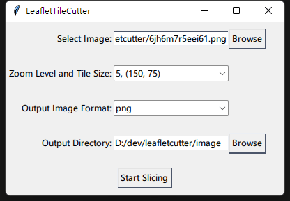
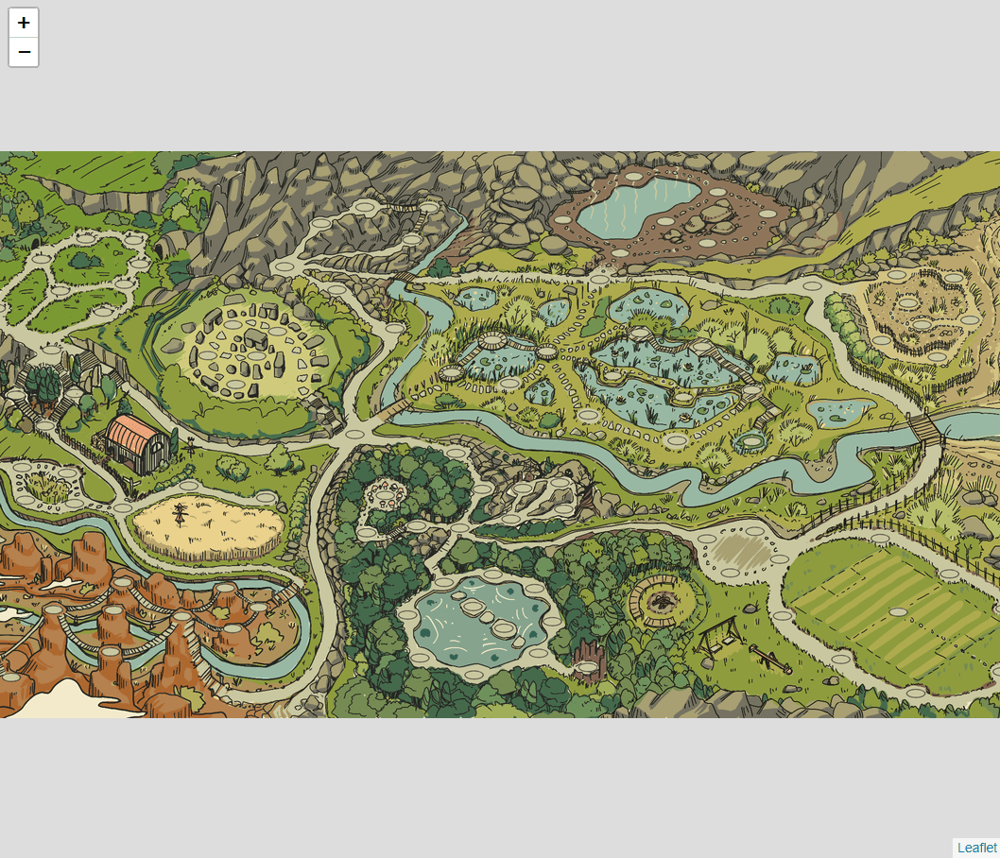
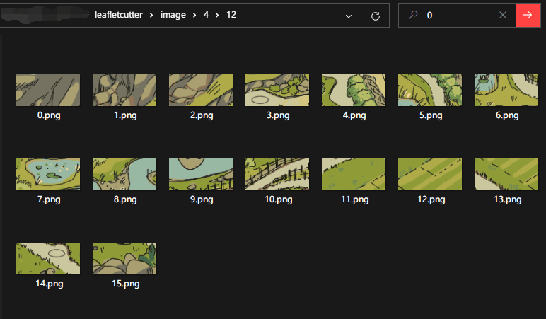

A tool designed to slice images into tiles for use with the Leaflet.js mapping library. 

## Features

- Image Slicing: take any image and slice it into tiles of a specified size, perfect for creating interactive maps.

- Zoom Level and Tile Size Selection: You can select the zoom level and tile size for your map, giving you full control over the final product.

- Example interactive Map Generation: Generates an HTML file with an interactive map using Leaflet.js, ready for you to test.

* 
* 
* 

